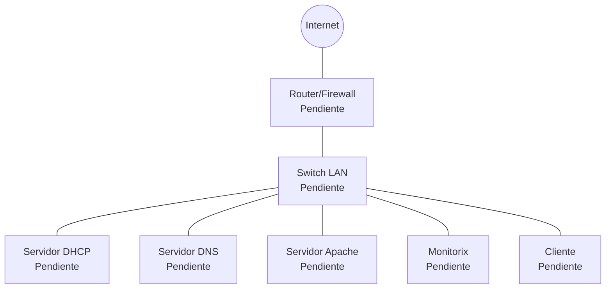

# Mapa lógico de la red

Reemplazar los componentes pendientes por los equipos reales y completar las interfaces y direcciones.

```mermaid
flowchart TB
    Internet((Internet))
    Router["Router/Firewall<br/>Pendiente"]
    Switch["Switch LAN<br/>Pendiente"]
    DHCP["Servidor DHCP<br/>Pendiente"]
    DNS["Servidor DNS<br/>Pendiente"]
    Web["Servidor Apache<br/>Pendiente"]
    Monitor["Monitorix<br/>Pendiente"]
    Client["Cliente<br/>Pendiente"]

    Internet --- Router
    Router --- Switch
    Switch --- DHCP
    Switch --- DNS
    Switch --- Web
    Switch --- Monitor
    Switch --- Client
```
