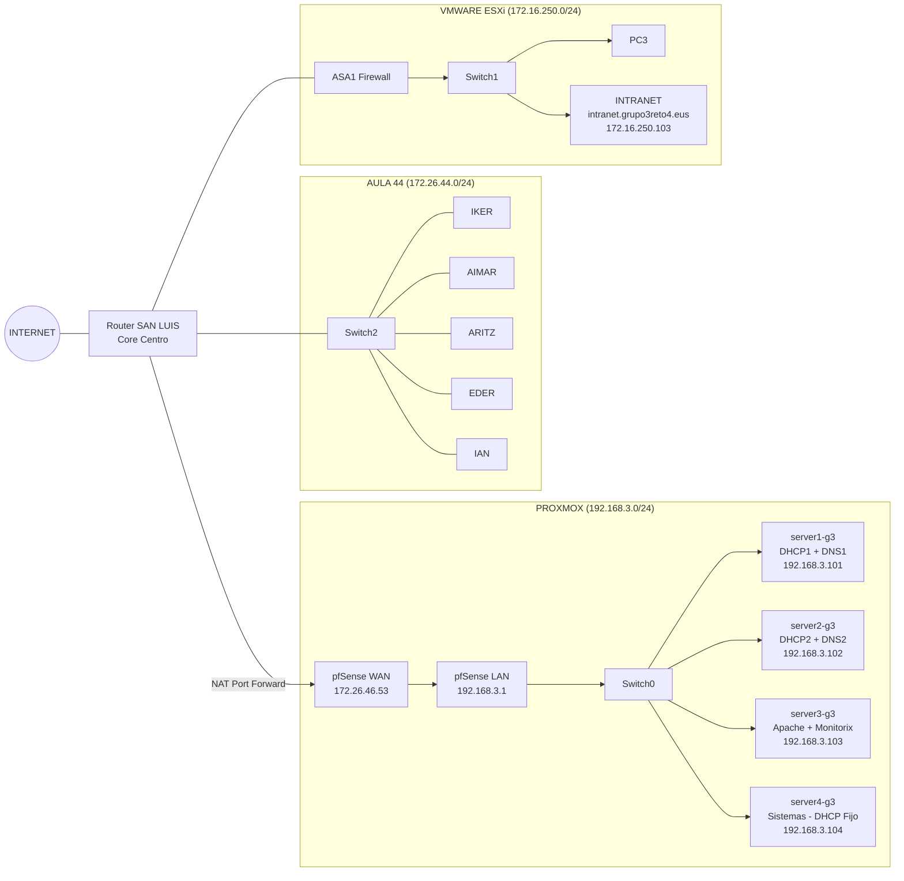

```mermaid
flowchart LR
    INTERNET((INTERNET)) --- SANLUIS[Router SAN LUIS<br/>Core Centro]

    subgraph AULA["AULA 44 (172.26.44.0/24)"]
        SW2[Switch2]
        SW2 --- IKER[IKER]
        SW2 --- AIMAR[AIMAR]
        SW2 --- ARITZ[ARITZ]
        SW2 --- EDER[EDER]
        SW2 --- IAN[IAN]
    end

    SANLUIS --- SW2

    subgraph PROXMOX["PROXMOX (192.168.3.0/24)"]
        PFSENSE_WAN[pfSense WAN<br/>172.26.46.53] --> PFSENSE_LAN[pfSense LAN<br/>192.168.3.1]
        PFSENSE_LAN --> SW0[Switch0]
        SW0 --> S1[server1-g3<br/>DHCP1 + DNS1<br/>192.168.3.101]
        SW0 --> S2[server2-g3<br/>DHCP2 + DNS2<br/>192.168.3.102]
        SW0 --> S3[server3-g3<br/>Apache + Monitorix<br/>192.168.3.103]
        SW0 --> S4[server4-g3<br/>Sistemas - DHCP Fijo<br/>192.168.3.104]
    end

    SANLUIS -->|NAT Port Forward| PFSENSE_WAN

    subgraph ESXI["VMWARE ESXi (172.16.250.0/24)"]
        ASA1[ASA1 Firewall] --> SW1[Switch1]
        SW1 --> PC3[PC3]
        SW1 --> INTRANET[INTRANET<br/>intranet.grupo3reto4.eus<br/>172.16.250.103]
    end

    SANLUIS --- ASA1
```